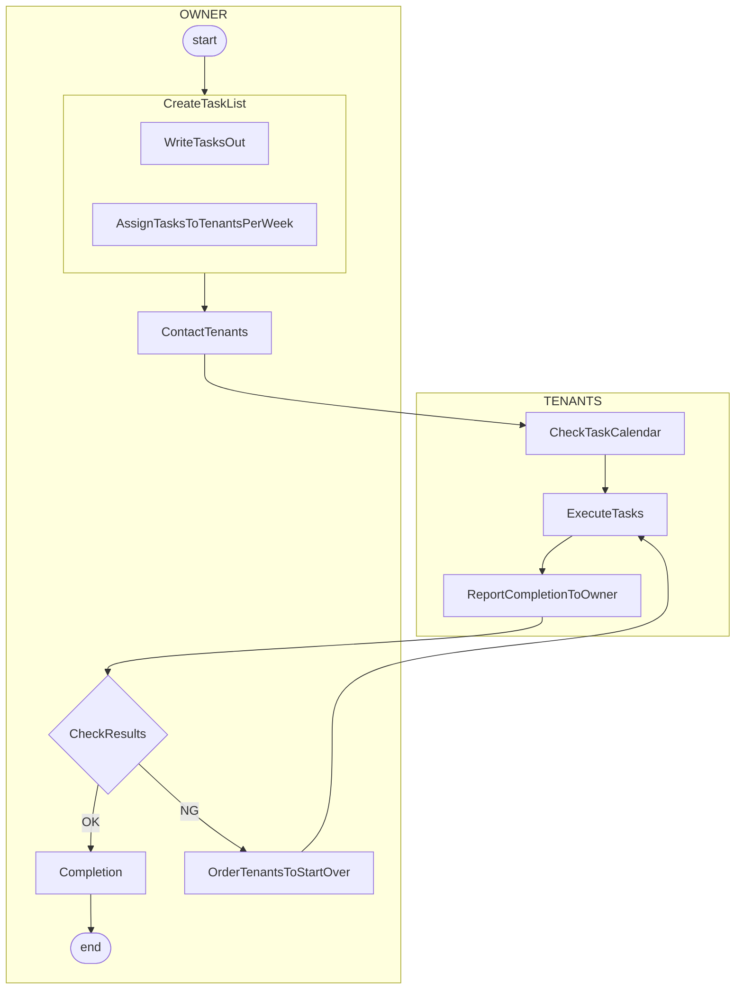

# CURRENT TASK FLOWCHART

```mermaid
flowchart TB
  %% Owner graph
  subgraph OWNER
    S([start]) --> CreateTaskList
    direction TB
    subgraph CreateTaskList
    WriteTasksOut
    AssignTasksToTenantsPerWeek
    end
    CreateTaskList --> ContactTenants
  end

  %% System graph
  subgraph TENANTS
    direction TB
    CheckTaskCalendar --> ExecuteTasks
    ExecuteTasks --> ReportCompletionToOwner
    ReportCompletionToOwner
  end

  %% Owner graph
  subgraph OWNER
    direction TB
    CheckResults{CheckResults}
    CheckResults --> |OK| Completion
    CheckResults --> |NG| OrderTenantsToStartOver
    Completion --> E([end])
  end

  %% Connect tasks
    ContactTenants  --> CheckTaskCalendar
    ReportCompletionToOwner --> CheckResults
    OrderTenantsToStartOver --> ExecuteTasks
```
