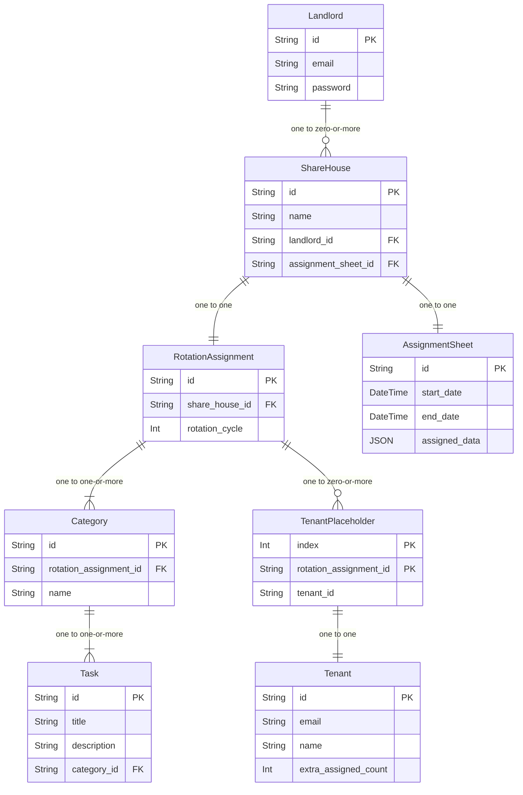

# ER Diagram

```mermaid
erDiagram
    Landlord {
        String id PK
        String email
        String password
    }

    ShareHouse {
        String id PK
        String name
        String landlord_id FK
        String assignment_sheet_id FK
    }

    RotationAssignment {
        String id PK
        String share_house_id FK
        Int rotation_cycle
    }

    Category {
        String id PK
        String rotation_assignment_id FK
        String name
    }

    Task {
        String id PK
        String title
        String description
        String category_id FK
    }

    Tenant {
        String id PK
        String email
        String name
        Int extra_assigned_count
    }

    TenantPlaceholder {
        Int index PK
        String rotation_assignment_id PK
        String tenant_id
    }

    AssignmentSheet {
        String id PK
        DateTime start_date
        DateTime end_date
        JSON assigned_data
    }

    Landlord ||--o{ ShareHouse : "one to zero-or-more"
    ShareHouse ||--|| RotationAssignment : "one to one"
    ShareHouse ||--|| AssignmentSheet : "one to one"
    RotationAssignment ||--|{ Category : "one to one-or-more"
    RotationAssignment ||--o{ TenantPlaceholder : "one to zero-or-more"
    TenantPlaceholder ||--|| Tenant : "one to one"
    Category ||--|{ Task : "one to one-or-more"
```
