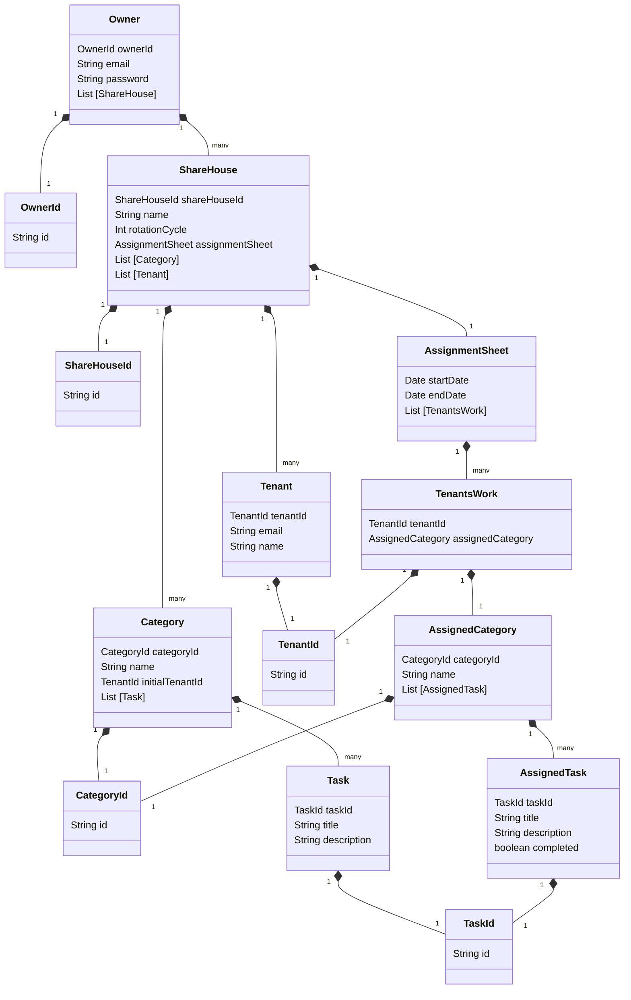

# Domain model

# Terms and Constraints

## Owner - オーナー

## ShareHouse - シェアハウス

The Landlord can register a ShareHouse which they own.

### ShareHouse ID (Identifier)

The ShareHouse ID is the UUID.

### ShareHouse Name

The ShareHouse has a default name when created without specifying one.

Constraints：

- Uniqueness
- Greater than or equal to 1 character
- Less than or equal to 15 characters
- Can be modified by Landlord as they like
- Uppercase and lowercase letters are recognized as the same characters

### rotationCycle

The rotationCycle must be set to Weekly or Fortnightly.

Constraints：

- Cannot be assigned to a Category until the rotationCycle is set.

### assignmentSheet

The assignmentSheet is the tenant's task assignment table.

### List[Category]

The ShareHouse contains Category. The ShareHouse has Category list.

### List[Tenant]

The ShareHouse contains Tenant. The ShareHouse has Tenant list.

## Category - カテゴリー

## Task - タスク

## Tenant - テナント

## AssignmentSheet - 分担票

### startDate

### endDate:

### TenantsWork

## TenantsWork -

## AssignedCategory -　

## AssignedTask -
