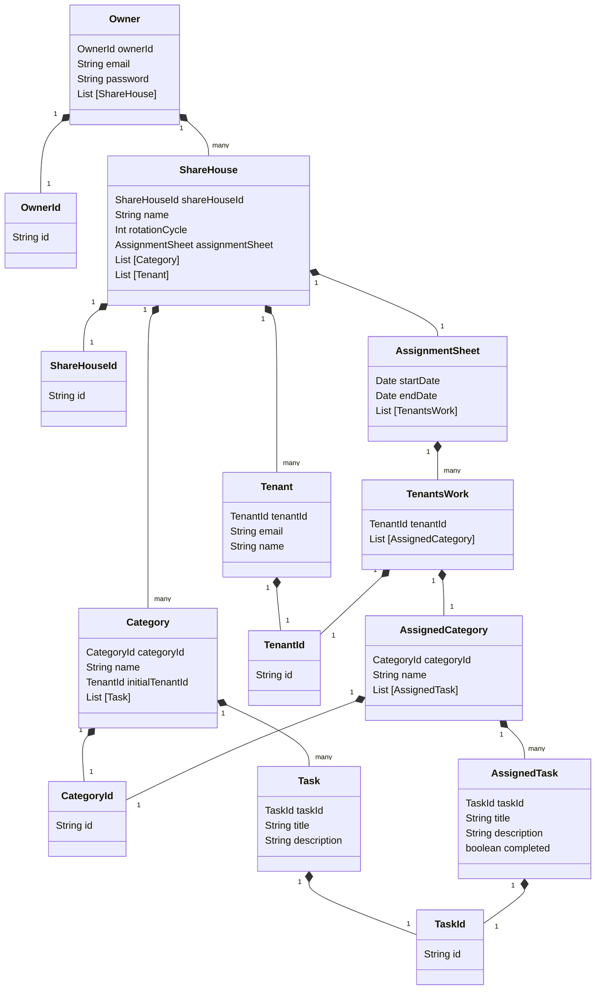

# Domain model

# Terms and Constraints

## Owner - オーナー

## ShareHouse - シェアハウス

## Category - カテゴリー

## Task - タスク

## Tenant - テナント

## AssignmentSheet - 分担票

## TenantsWork - 割当

TenantsWork refers to the set of tasks assigned(AssignedCategory) to each tenant.

### Tenant IDs

The TenantsWork contains Tenants. The TenantsWork class has Tenant ID.

Constraints:

- The TenantsWork cannot exist without any Tenants.

### AssignedCategory

The TenantsWork contains AssignedCategory. The TenantsWork class has AssignedCategory list.

Constraints:

- The TenantsWork cannot exist without any AssignedCategory.

## AssignedCategory -　

## AssignedTask -
