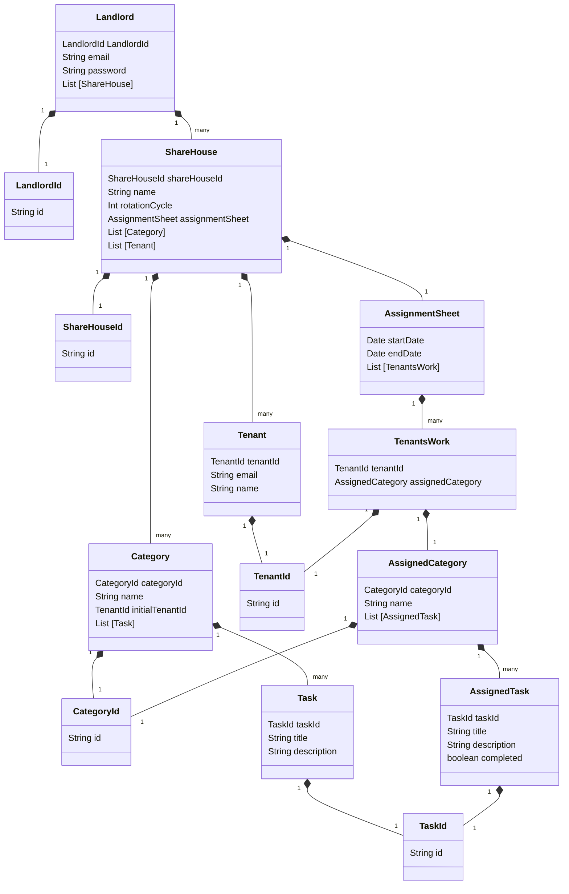

# Domain model

# Terms and Constraints

## Landlord - 大家

### Landlord

The Landlord contains ShareHouse.

### Landlord ID (Identifier)

The Landlord ID is a UUID.

### Email Address (Value Object)

The Landlord has an email address.

Constraints:

- unique. (Landlords cannot create multiple accounts with the same email address).
- in a valid format.

### Password

The Landlord has a password.

Constraints:

- at least 8 characters long.
- less than 30 characters long.
- at least 1 capital letter.
- at least 1 lowercase letter.
- at least 1 special character.
- at least 1 number.
- can be modified by Tenant at any time

## ShareHouse - シェアハウス

## Category - カテゴリー

## Task - タスク

## Tenant - テナント

## AssignmentSheet - 分担票

## TenantsWork -

## AssignedCategory -　

## AssignedTask -
