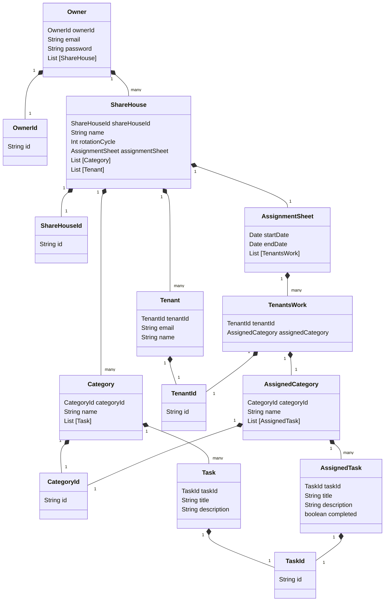

# Domain model

# Terms and Constraints

## Owner - オーナー

## ShareHouse - シェアハウス

## Category - カテゴリー

Group to which Task belongs. The landlord can add Task to Categories after creating Category.

#### Constraints

- The maximum number of Categories is 20, and there must be at least one Category per sharehouse.

### Category ID

Category ID is an unique ID.

### Name

The name of group to which Task belongs.  
Kitchen, Bathroom, Entrance and Living room are set by default. The landlord can create additional categories as they like apart from those listed.

#### Constraints

- Name must be unique.
- It must be less than equal to 15 letters and greater than equal to 1.

### Task

Category contains Task. Category has Task list.

#### Constraints

- Category must contain at least one Task.

## Task - タスク

## Tenant - テナント

## AssignmentSheet - 分担票

## TenantsWork -

## AssignedCategory -　

## AssignedTask -
