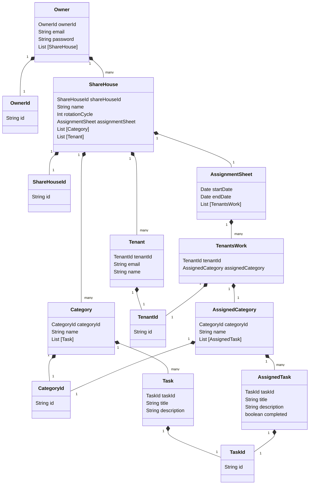

# Domain model

# Terms and Constraints

## Owner - オーナー

## ShareHouse - シェアハウス

## Category - カテゴリー

The Category is a group to which Task belongs. The landlord can add a Task to the Category after creating Category.  
Display a warning dialog when deleting Category that owns Tasks.

#### Constraints

- The maximum number of Categories is 15
- At least one Category per ShareHouse
- Category doesn't exist unless there is at least one task associated with it

### Category ID

Category ID is the UUID.

### Name

The name of Category to which Task belongs.  
Kitchen, Bathroom, Entrance and Living room are set by default. The landlord can create additional categories as they like apart from those listed.

#### Constraints

- Uniqueness
- Less than or equal to 15 letters
- Greater than or equal to 1 letter
- Can be modified by Landlord as they like
- Uppercase and lowercase letters are recognized as the same characters

### List [Task]

Category contains a list of tasks.  
Display a waring dialog when relocating a Task, which is the only one in the Category, to another Category.

#### Constraints

- Must contain at least one Task
- Can relocate to only existing Category

## Task - タスク

## Tenant - テナント

## AssignmentSheet - 分担票

## TenantsWork -

## AssignedCategory -

## AssignedTask -
