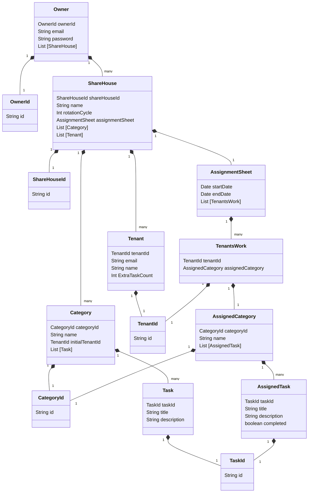

# Domain model

# Terms and Constraints

## Owner - オーナー

## ShareHouse - シェアハウス

## Category - カテゴリー

## Task - タスク

## Tenant - テナント

### Tenant ID (Identifier)

The Tenant ID is the UUID.

### Name

The Tenant has a name.

Constraints:

- Name must be at least one character no more than 15 characters.
- Name must be unique (no duplicates).
- Name can set a group name as they like, not limited to the actual personal name.
- Name can change anytime.

### Email Address (Value Object)

The Tenant has an email address.

Constraints:

- Email Address must be unique.
- Email Address cannot be changed after sending invitation mail.

### ExtraTaskCount

The default number of The ExtraTaskCount is 0. If the number of Categories is larger than the number of Tenants, ExtraTaskCount is used to ensure that an equal number of tasks(Category) are assigned to each Tenant.

Constraints:

- ExtraTaskCount must be more than 0.
- ExtraTaskCount must be integer

## AssignmentSheet - 分担票

## TenantsWork -

## AssignedCategory -　

## AssignedTask -
