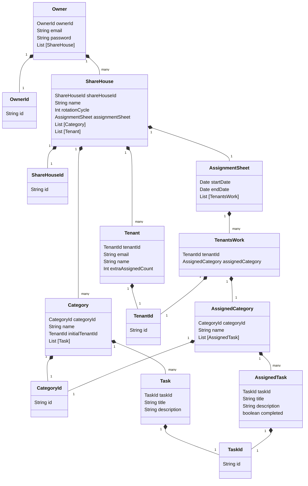

# Domain model

# Terms and Constraints

## Owner - オーナー

## ShareHouse - シェアハウス

## Category - カテゴリー

## Task - タスク

## Tenant - テナント

### Tenant ID (Identifier)

The Tenant ID is the UUID.

### Name

The Tenant has a name.

Constraints:

- Greater than or equal to 1 character and less than or equal to 15 characters.
- Uniqueness.
- Does not have to be the legal name; an arbitrary name can be used instead.
- Can be changed anytime.

### Email Address (Value Object)

The Tenant has an email address.

Constraints:

- Uniqueness.
- Should be recognized consistently, irrespective of capitalization.
- Cannot be changed after sending invitation mail.

### extraAssignedCount

The default number of The extraAssignedCount is 0. If the number of Categories is larger than the number of Tenants, extraAssignedCount is used to ensure that an equal number of tasks(Category) is assigned to each Tenant.

Constraints:

- extraAssignedCount must be more than 0.
- extraAssignedCount must be integer

## AssignmentSheet - 分担票

## TenantsWork -

## AssignedCategory -　

## AssignedTask -
