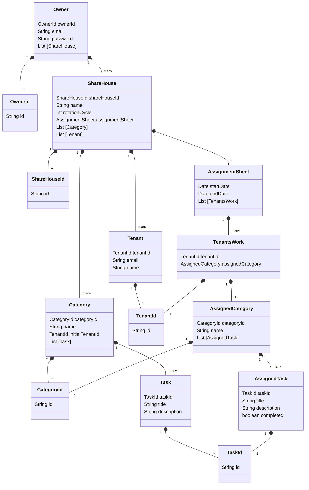

# Domain model

# Terms and Constraints

## Owner - オーナー

## ShareHouse - シェアハウス

## Category - カテゴリー

## Task - タスク

### Task

- A specific work or activity that tenants are responsible for performing.

### taskId

- TaskId is the UUID

#### Constraints:

### title

- The owner can set a title as they prefer. This title can be modified at any time.

#### Constraints:

    - It must be between 1 and 20 characters in length.

### description

- The owner can provide details for the task. The description must be between 10 and 120 characters. This description can be modified at any time.

#### Constraints:

    - It must be between 1 and 20 characters in length.

## Tenant - テナント

## AssignmentSheet - 分担票

## TenantsWork -

## AssignedCategory -　

## AssignedTask -
