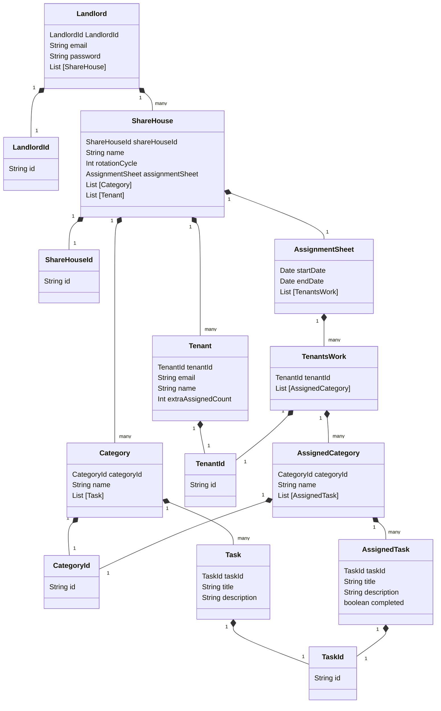

# Domain model

```mermaid
classDiagram
    class Landlord {
        LandlordId LandlordId
        String email
        String password
        List [ShareHouse]
    }

    class LandlordId {
        String id
    }

    class ShareHouse {
        ShareHouseId shareHouseId
        String name
        Int rotationCycle
        AssignmentSheet assignmentSheet
        List [Category]
        List [Tenant]
    }

    class ShareHouseId {
        String id
    }

    class AssignmentSheet {
        Date startDate
        Date endDate
        List [TenantsWork]
    }

    class Category {
        CategoryId categoryId
        String name
        List [Task]
    }

    class CategoryId {
        String id
    }

    class Task {
        TaskId taskId
        String title
        String description
    }

    class TaskId {
        String id
    }

    class Tenant {
        TenantId tenantId
        String email
        String name
        Int extraAssignedCount
    }

    class TenantId {
        String id
    }

    class TenantsWork {
        TenantId tenantId
        List [AssignedCategory]
    }

    class AssignedCategory {
        CategoryId categoryId
        String name
        List [AssignedTask]
    }

    class AssignedTask {
        TaskId taskId
        String title
        String description
        boolean completed
    }

    Landlord "1" *-- "1" LandlordId
    Landlord "1" *-- "many" ShareHouse
    ShareHouse "1" *-- "1" ShareHouseId
    ShareHouse "1" *-- "many" Category
    ShareHouse "1" *-- "many" Tenant
    ShareHouse "1" *-- "1" AssignmentSheet
    Category "1" *-- "1" CategoryId
    Category "1" *-- "many" Task
    Task "1" *-- "1" TaskId
    Tenant "1" *-- "1" TenantId
    AssignmentSheet "1" *-- "many" TenantsWork
    TenantsWork "1" *-- "many" AssignedCategory
    TenantsWork "1" *-- "1" TenantId
    AssignedCategory "1" *-- "1" CategoryId
    AssignedCategory "1" *-- "many" AssignedTask
    AssignedTask "1" *-- "1" TaskId

```

# Terms and Constraints

## Landlord - 大家

### Landlord

- The Landlord is the user of Tascurator.
- The Landlord owns Share houses.

### Landlord ID (Identifier)

- The Landlord ID is a UUID.

### Email (Value Object)

- The Landlord has an email address.

- **Constraints**
  - Must be unique
  - Must be in a valid format (Should be recognized consistently, irrespective of capitalization)
  - Cannot be changed

### Password

- The Landlord has a password.

- **Constraints**
  - Must be at least 1 character long
  - Must be no more than 8 characters long
  - Must contain at least 1 uppercase letter
  - Must contain at least 1 lowercase letter
  - Must contain at least 1 special character
  - Must contain at least 1 number
  - Can be changed by the Landlord at any time

## ShareHouse - シェアハウス

- The Landlord can register a Share house that they own.

- **Constraints**
  - A Landlord can have up to 10 Share houses.

### ShareHouse ID (Identifier)

- The ShareHouse ID is a UUID.

### ShareHouse Name

- The Landlord can set a Share house name as they prefer. This name can be changed at any time.

- **Constraints**
  - Must be unique
  - Must be at least 1 character long
  - Must be no more than 15 characters long
  - 🥕 Uppercase and lowercase letters are treated as the same
  - Can be modified by the Landlord at any time

<!-- ### rotationCycle

The rotationCycle must be set to Weekly or Fortnightly.

Constraints：

- Must be set to Weekly or Fortnightly. -->

<!-- ### assignmentSheet

The assignmentSheet is the tenant's task assignment table. -->

<!-- ### List[Category]

The Share house contains Category. The Share house has Category list.

### List[Tenant]

The Share house contains Tenant. The Share house has Tenant list. -->

## Category - カテゴリー

- A Category is a group to which Tasks belong. The Landlord can add Tasks to the Category.
- Kitchen, Bathroom, Entrance, and Living Room are set by default. The Landlord can delete default categories and also can create additional categories as they like.

- **Constraints**
  - Must have at least 1 Category
  - Can have up to 15 Categories
  - A Category cannot exist unless it has at least one Task associated with it

### Category ID

- The Category ID is a UUID.

### Name

- The name of the Category.

- **Constraints**
  - Must be unique
  - Must be at least 1 character long
  - Must be no more than 15 characters long
  - Can be modified by the Landlord at any time
  - 🥕 Uppercase and lowercase letters are treated as the same

### List [Task]

- A Category contains a list of Tasks.

- **Constraints**
  - Must contain at least one Task

## Task - タスク

### Task

- A specific work or activity that tenants are responsible for performing.
- **Constraints**
  - A category can contain up to 20 Tasks

### taskId (Identifier)

- The Task ID is a UUID.

### title

- The title is the name of the task.

- **Constraints**
  - Must be at least 1 character long
  - Must be no more than 20 characters long
  - Can be changed at any time
  - Must be contained in a Category

### Description

- The Landlord can provide details for a task.

- **Constraints**
  - Must be at least 10 characters long
  - Must be no more than 1000 characters long
  - Can be changed at any time
  - Can include bold, underline, and bulleted or numbered lists

## Tenant - テナント

- The people who live in the share house.
- The Landlord can add Tenant to the Share house.

- **Constraints**
  - A Share house can have up to 20 Tenants.

### Tenant ID (Identifier)

- The Tenant ID is a UUID.

### Name

- The Tenant has a name.

- **Constraints**
  - Must be unique
  - Must be at least 1 character long
  - Must be no more than 15 characters long
  - Does not have to be the legal name; an arbitrary name can be used instead
  - Can be changed at any time

### Email (Value Object)

- The Tenant has an email address.

- **Constraints**
  - Must be unique
  - Must be in a valid format (Should be recognized consistently, irrespective of capitalization)
  - Cannot be changed after sending the invitation email

### extraAssignedCount

- If the number of Categories is greater than the number of Tenants, extraAssignedCount is used to ensure that an equal number of Categories is assigned to each Tenant.
- The default value of extraAssignedCount is 0.

- **Constraints**
  - Must be greater than 0

## AssignmentSheet - 分担票

- Tenant's task assignment table.

### startDate

The startDate of the task to be performed by the Tenant.

Constraints：

- Must contain the startDate
- The time zone is PST (Pacific Standard Time)

### endDate:

The deadline for completing the task.

Constraints：

- The time zone is PST (Pacific Standard Time)

### List [TenantsWork]

The TenantsWork has tasks assigned to each tenant AssignedCategory.

## TenantsWork - 割当

## TenantsWork(Entity)

TenantsWork refers to the set of tasks assigned(AssignedCategory) to each tenant.

Constraints:

- Cannot exist without any AssignedCategory.
- Have only 1 TenantId.
- Can have greater than or equal to 1 AssignedCategory.

### Tenant ID

The TenantsWork class has Tenant ID. TenantsWork will be created per Tenant.

### AssignedCategory

The TenantsWork contains AssignedCategory. The TenantsWork class has AssignedCategory list.

## AssignedCategory -　割当カテゴリー

Category assigned to each tenant.  
AssignedCategory, which refers to the Category, cannot exist without Category.

### Category ID

Category ID is the UUID set for Category assigned to a tenant.

### Name

Name is set for Category assigned to a tenant.

### List [AssignedTask]

AssignedCategory contains a list of AssignedTasks.

## AssignedTask - 割当タスク

### taskId

A UUID set for `Task` assigned to a `Tenant`.

### title

A task which is assigned to each `Tenant`
AssignedTask, which refers to a `Task`, cannot exist without `Task`.

### description

A description of each AssignedTask

### completed

A boolean value of a task status.
