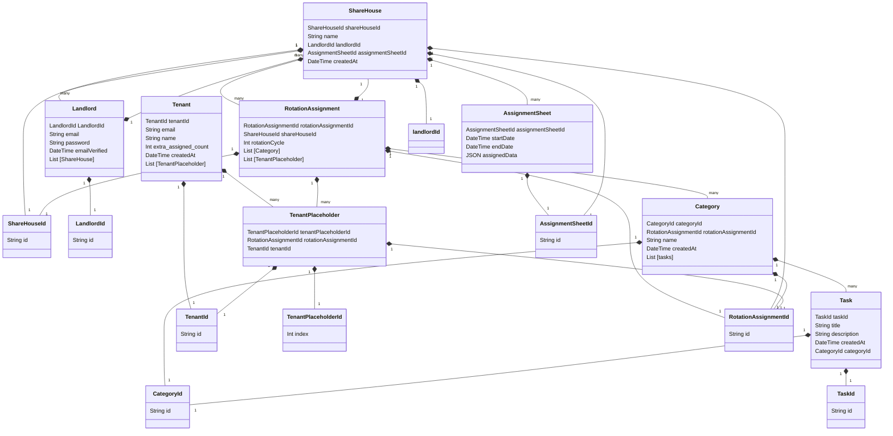

# Domain model

```mermaid
classDiagram

    class ShareHouse {
        ShareHouseId shareHouseId
        String name
        LandlordId landlordId
        AssignmentSheetId assignmentSheetId
        DateTime createdAt
    }

    class ShareHouseId {
        String id
    }

    class Landlord {
        LandlordId LandlordId
        String email
        String password
        DateTime emailVerified
        List [ShareHouse]
    }

    class LandlordId {
        String id
    }

    class Category {
        CategoryId categoryId
        RotationAssignmentId rotationAssignmentId
        String name
        DateTime createdAt
        List [tasks]
    }

    class CategoryId {
        String id
    }

    class Task {
        TaskId taskId
        String title
        String description
        DateTime createdAt
        CategoryId categoryId
    }

    class TaskId {
        String id
    }

    class Tenant {
        TenantId tenantId
        String email
        String name
        Int extra_assigned_count
        DateTime createdAt
        List [TenantPlaceholder]
    }

    class TenantId {
        String id
    }

    class TenantPlaceholder {
        TenantPlaceholderId tenantPlaceholderId
        RotationAssignmentId rotationAssignmentId
        TenantId tenantId
    }

    class TenantPlaceholderId {
        Int index
    }

    class RotationAssignment {
        RotationAssignmentId rotationAssignmentId
        ShareHouseId shareHouseId
        Int rotationCycle
        List [Category]
        List [TenantPlaceholder]
    }

    class RotationAssignmentId {
        String id
    }

    class AssignmentSheet {
        AssignmentSheetId assignmentSheetId
        DateTime startDate
        DateTime endDate
        JSON assignedData
    }

    class AssignmentSheetId {
        String id
    }

    Landlord "1" *-- "1" LandlordId
    ShareHouse "1" *-- "1" ShareHouseId
    Category "1" *-- "1" CategoryId
    Task "1" *-- "1" TaskId
    Tenant "1" *-- "1" TenantId
    AssignmentSheet "1" *-- "1" AssignmentSheetId
    TenantPlaceholder "1" *-- "1" TenantPlaceholderId

    RotationAssignment "1" *-- "1" RotationAssignmentId
    ShareHouse "1" *-- "1" landlordId
    ShareHouse "1" *-- "1" AssignmentSheetId
    ShareHouse "1" *-- "1" RotationAssignmentId
    ShareHouse "1" *-- "many" Landlord
    ShareHouse "1" *-- "many" AssignmentSheet
    ShareHouse "1" *-- "many" RotationAssignment
    Landlord "1" *-- "many" ShareHouse
    Category "1" *-- "1" RotationAssignmentId
    Category "1" *-- "many" Task
    Task "1" *-- "1" CategoryId
    Tenant "1" *-- "many" TenantPlaceholder
    TenantPlaceholder "1" *-- "1" TenantId
    TenantPlaceholder "1" *-- "1" RotationAssignmentId
    RotationAssignment "1" *-- "1" ShareHouseId
    RotationAssignment "1" *-- "many" Category
    RotationAssignment "1" *-- "many" TenantPlaceholder
    RotationAssignment "1" *-- "1" ShareHouse

```

# Attributes and Constraints

## Landlord

### Attributes

- **id**: A unique identifier for the landlord. This is a UUID.
- **email**: An email address of the landlord.
- **password**: A password for the landlord's account.
- **emailVerified**: A date-time value indicating when the landlord's email was verified. This can be null if the email has not been verified.

### Constraints

- `email` must be unique and follow a valid email format.
- `email` cannot be changed.
- `password` must meet specific security requirements, including:
  - At least 1 character and no more than 8 characters.
  - At least 1 capital letter.
  - At least 1 lowercase letter.
  - At least 1 special character.
  - At least 1 number.
  - Can be changed by the **`Landlord`** at any time.

## ShareHouse

### Attributes

- **id**: A unique identifier for the share house. This is a UUID.
- **name**: A name of the share house, named by the landlord.
- **createdAt**: A timestamp indicating when the share house was registered.
- **landlord_id**: An ID of the landlord who owns the share house. This establishes a relationship with the Landlord model.
- **assignment_sheet_id**: An ID of the assignment sheet associated with the share house. This establishes a relationship with the AssignmentSheet model.

### Constraints

- **`Landlord`** can have up to 10 **`ShareHouse`**.
- `name` must meet specific requirements, including:
  - At least 1 character and no more than 15 characters.
  - Must be unique.
  - Uppercase and lowercase letters are treated as distinct.
  - Can be modified by the **`Landlord`** at any time.

## Category

### Attributes

- **id**: A unique identifier for the category. This is a UUID.
- **name**: The name of the category, named by the landlord.
- **createdAt**: The timestamp indicating when the category was created.
- **rotation_assignment_id**: The ID of the rotation assignment associated with this category. This establishes a relationship with the RotationAssignment model.

### Constraints

- **`Landlord`** can have up to 15 **`Category`**.
- **`Category`** must contain at least one **`Task`**.
- `name` must meet specific requirements, including:
  - At least 1 character and no more than 15 characters.
  - Must be unique
  - Uppercase and lowercase letters are treated as distinct.
  - Can be modified by the **`Landlord`** at any time.

## Task

### Attributes

- **id**: A unique identifier for the task. This is a UUID.
- **title**: The name of the task, named by the landlord.
- **createdAt**: The timestamp indicating when the task was created.
- **description**: A detailed description of what the task involves. This helps tenants understand what is required to complete the task.
- **category_id**: The ID of the category to which this task belongs. This establishes a relationship with the Category model.

### Constraints

- **`Category`** can contain up to 20 **`Task`**.
- Every **`Task`** must belong to a **`Category`**.
- `title` must meet specific requirements, including:
  - At least 1 character and no more than 20 characters.
  - Can be modified by the **`Landlord`** at any time.
- `description` must meet specific requirements, including:
  - At least 10 character and no more than 1000 characters.
  - Can be modified by the **`Landlord`** at any time.
- `description` can include bold, italic, and underline text, as well as bulleted or numbered lists.

## Tenant

### Attributes

- **id**: A unique identifier for the tenant. This is a UUID.
- **email**: The email address of the tenant. This is used for account management.
- **name**: The tenant's name. This can be an arbitrary name and does not need to be the tenant's legal name.
- **createdAt**: The timestamp indicating when the tenant was registered.
- **extra_assigned_count**: An integer representing the number of additional tasks assigned to the tenant. This is used to ensure an equal distribution of tasks among tenants when the number of tasks exceeds the number of tenants. The default value is 0.

### Constraints

- **`Sharehouse`** can have up to 20 **`Tenant`**.
- `email` must be unique and follow a valid email format.
- `email` cannot be changed after sending the invitation mail.
- `name` must meet specific requirements, including:
  - At least 1 character and no more than 15 characters.
  - Must be unique
  - Uppercase and lowercase letters are treated as distinct.
  - Can be modified by the **`Landlord`** at any time.
- `extra_assigned_count` must be an integer greater than or equal to 0.

## AssignmentSheet

### Attributes

- **id**: A unique identifier for the assignment sheet. This is a UUID.
- **start_date**: The start date for the task assignment period. This indicates when the tasks should begin.
- **end_date**: The end date for the task assignment period. This indicates the deadline for completing the tasks.
- **assigned_data**: A JSON object containing the detailed task assignments for each tenant.

### Constraints

- The time zone is PST (Pacific Standard Time) or PDT(Pacific Daylight Time).
- **`AssignmentSheet`** must linked to a **`ShareHouse`**.

## RotationAssignment

### Attributes

- **id**: A unique identifier for the rotation assignment. This is a UUID.
- **share_house_id**: The ID of the ShareHouse to which this rotation assignment belongs. This links the rotation assignment to a specific ShareHouse.
- **rotation_cycle**: Specifies the frequency of task rotation. This can be set to either "Weekly"(7 days) or "Fortnightly"(14 days).

### Constraints

- Must be linked to one **`ShareHouse`**.
- Must be linked to one or more one **`Category`**.
- The `rotation_cycle` must be set to either "Weekly" or "Fortnightly".

## TenantPlaceholder

### Attributes

- **index**: An integer indicating the position within the rotation cycle. This specifies the order of tenants.
- **rotation_assignment_id**: The ID of the RotationAssignment to which this TenantPlaceholder belongs.
- **tenant_id**: The ID of the tenant assigned to this position. This is optional and can be null if no specific tenant is assigned.

### Constraints

- Must be linked to one **`RotationAssignment`**.
- Can link to one **`Tenant`**, but it is not mandatory (it can be null).
- `index` must indicate a unique order within the `rotation_cycle`.
