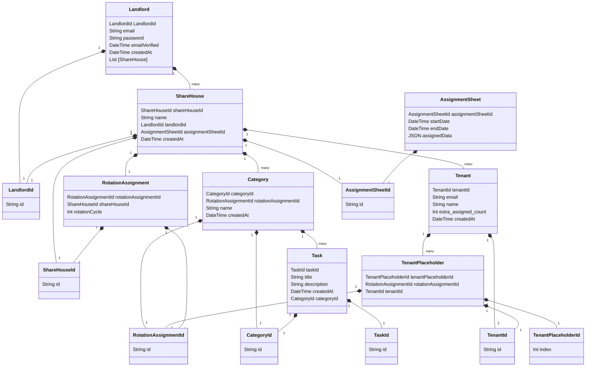

# Domain model

```mermaid
classDiagram
    class Landlord {
        LandlordId LandlordId
        String email
        String password
        DateTime emailVerified
        DateTime createdAt
        List [ShareHouse]
    }

    class LandlordId {
        String id
    }

    class ShareHouse {
        ShareHouseId shareHouseId
        String name
        LandlordId landlordId
        AssignmentSheetId assignmentSheetId
        DateTime createdAt
    }

    class ShareHouseId {
        String id
    }

    class Category {
        CategoryId categoryId
        RotationAssignmentId rotationAssignmentId
        String name
        DateTime createdAt
    }

    class CategoryId {
        String id
    }

    class Task {
        TaskId taskId
        String title
        String description
        DateTime createdAt
        CategoryId categoryId
    }

    class TaskId {
        String id
    }

    class Tenant {
        TenantId tenantId
        String email
        String name
        Int extra_assigned_count
        DateTime createdAt
    }

    class TenantId {
        String id
    }

    class TenantPlaceholder {
        TenantPlaceholderId tenantPlaceholderId
        RotationAssignmentId rotationAssignmentId
        TenantId tenantId
    }

    class TenantPlaceholderId {
        Int index
    }

    class RotationAssignment {
        RotationAssignmentId rotationAssignmentId
        ShareHouseId shareHouseId
        Int rotationCycle
    }

    class RotationAssignmentId {
        String id
    }

    class AssignmentSheet {
        AssignmentSheetId assignmentSheetId
        DateTime startDate
        DateTime endDate
        JSON assignedData
    }

    class AssignmentSheetId {
        String id
    }


    Landlord "1" *-- "1" LandlordId
    Landlord "1" *-- "many" ShareHouse
    ShareHouse "1" *-- "1" ShareHouseId
    ShareHouse "1" *-- "1" LandlordId
    ShareHouse "1" *-- "1" AssignmentSheetId
    ShareHouse "1" *-- "1" RotationAssignment
    ShareHouse "1" *-- "many" Category
    ShareHouse "1" *-- "many" Tenant
    Category "1" *-- "1" CategoryId
    Category "1" *-- "1" RotationAssignmentId
    Category "1" *-- "many" Task
    Task "1" *-- "1" TaskId
    Task "1" *-- "1" CategoryId
    Tenant "1" *-- "1" TenantId
    Tenant "1" *-- "many" TenantPlaceholder
    TenantPlaceholder "1" *-- "1" TenantPlaceholderId
    TenantPlaceholder "1" *-- "1" RotationAssignmentId
    TenantPlaceholder "1" *-- "1" TenantId
    RotationAssignment "1" *-- "1" RotationAssignmentId
    RotationAssignment "1" *-- "1" ShareHouseId
    AssignmentSheet "1" *-- "1" AssignmentSheetId

```

# Terms and Constraints

## Landlord

- Landlord represents the owner of a share house in the system. The landlord is responsible for managing the share house, including setting tasks and overseeing the general operations of the property.
- The landlord uses the system to manage share houses and assign tasks to tenants.

### Attributes

- **id**: A unique identifier for the landlord. This is a UUID.
- **email**: The email address of the landlord.
- **password**: The password for the landlord's account.
- **emailVerified**: A date-time value indicating when the landlord's email was verified. This can be null if the email has not been verified.

### Relationships

- **ShareHouse**: A landlord can own multiple share houses. This is represented by a one-to-many relationship between Landlord and ShareHouse.

### Constraints

- The email attribute must be unique and follow a valid email format.
- The email address cannot be changed.
- The password must meet specific security requirements, including:
  - At least 1 character and no more than 8 characters.
  - At least 1 capital letter.
  - At least 1 lowercase letter.
  - At least 1 special character.
  - At least 1 number.
  - Can be changed by the landlord at any time.

## ShareHouse

- ShareHouse represents a shared residential property owned by a landlord.

### Attributes

- **id**: A unique identifier for the share house. This is a UUID.
- **name**: The name of the share house, named by the landlord.
- **createdAt**: The timestamp indicating when the share house was registered.
- **landlord_id**: The ID of the landlord who owns the share house. This establishes a relationship with the Landlord model.
- **assignment_sheet_id**: The ID of the assignment sheet associated with the share house. This establishes a relationship with the AssignmentSheet model.

### Relationships

- **Landlord**: Each ShareHouse is owned by one Landlord. This is represented by a many-to-one relationship between ShareHouse and Landlord.
- **AssignmentSheet**: Each ShareHouse has one AssignmentSheet associated with it, detailing the tasks assigned to tenants.
- **RotationAssignment**: Each ShareHouse has one RotationAssignment, which specifies the rotation cycle and assignments for the house.

### Constraints

- A Landlord can have up to 10 share houses.
- Share house name must meet specific requirements, including:
  - At least 1 character and no more than 15 characters.
  - Must be unique.
  - Uppercase and lowercase letters are treated as distinct.
  - Can be modified by the landlord at any time.

## Category

- Category represents a classification or group of tasks within a share house.
- Kitchen, Bathroom, Entrance, and Living Room are set by default. Landlords can create and delete categories as needed.

### Attributes

- **id**: A unique identifier for the category. This is a UUID.
- **name**: The name of the category, named by the landlord.
- **createdAt**: The timestamp indicating when the category was created.
- **rotation_assignment_id**: The ID of the rotation assignment associated with this category. This establishes a relationship with the RotationAssignment model.

### Relationships

- **RotationAssignment**: Each Category is linked to one RotationAssignment, which dictates the rotation schedule and task assignments.
- **Task**: Each Category contains one or more Task objects. Tasks are assigned to specific categories to organize and manage tenant responsibilities.

### Constraints

- A Landlord can have up to 15 share houses.
- Category must contain at least one task
- Category name must meet specific requirements, including:
  - At least 1 character and no more than 15 characters.
  - Must be unique
  - Uppercase and lowercase letters are treated as distinct.
  - Can be modified by the landlord at any time.

## Task

- Task represents a specific work or activity that tenants are responsible for performing within a share house. Tasks are assigned to categories to help organize and manage responsibilities.

### Attributes

- **id**: A unique identifier for the task. This is a UUID.
- **title**: The name of the task, named by the landlord.
- **createdAt**: The timestamp indicating when the task was created.
- **description**: A detailed description of what the task involves. This helps tenants understand what is required to complete the task.
- **category_id**: The ID of the category to which this task belongs. This establishes a relationship with the Category model.

### Relationships

- **Category**: Each Task is linked to one Category, which organizes tasks into groups based on their nature or location.

### Constraints

- A category can contain up to 20 Tasks.
- Every task must belong to a category.
- Task title must meet specific requirements, including:
  - At least 1 character and no more than 20 characters.
  - Can be modified by the landlord at any time.
- Task description must meet specific requirements, including:
  - At least 10 character and no more than 1000 characters.
  - Can be modified by the landlord at any time.
- The description can include bold, italic, and underline text, as well as bulleted or numbered lists.

## Tenant

- Tenant represents a person who resides in a share house and is responsible for carrying out assigned tasks. Tenants are associated with specific share houses and can have various responsibilities within the house.

### Attributes

- **id**: A unique identifier for the tenant. This is a UUID.
- **email**: The email address of the tenant. This is used for account management.
- **name**: The tenant's name. This can be an arbitrary name and does not need to be the tenant's legal name.
- **createdAt**: The timestamp indicating when the tenant was registered.
- **extra_assigned_count**: An integer representing the number of additional tasks assigned to the tenant. This is used to ensure an equal distribution of tasks among tenants when the number of tasks exceeds the number of tenants. The default value is 0.

### Relationships

- **ShareHouse**: Each Tenant is associated with one ShareHouse.
- **TenantPlaceholder**: Each Tenant associate with one TenantPlaceholder.

### Constraints

- A Share house can have up to 20 Tenants.
- The email attribute must be unique and follow a valid email format.
- The email address cannot be changed after sending the invitation mail.
- Tenant name must meet specific requirements, including:
  - At least 1 character and no more than 15 characters.
  - Must be unique
  - Uppercase and lowercase letters are treated as distinct.
  - Can be modified by the landlord at any time.
- ExtraAssignedCount must be an integer greater than or equal to 0.

## AssignmentSheet

- AssignmentSheet represents a task assignment table for tenants within a share house. It contains details about the tasks assigned to each tenant over a specified period.

### Attributes

- **id**: A unique identifier for the assignment sheet. This is a UUID.
- **start_date**: The start date for the task assignment period. This indicates when the tasks should begin.
- **end_date**: The end date for the task assignment period. This indicates the deadline for completing the tasks.
- **assigned_data**: A JSON object containing the detailed task assignments for each tenant.

### Relationships

- **ShareHouse**: Each AssignmentSheet is associated with one ShareHouse.

### Constraints

- The time zone is PST (Pacific Standard Time) or PDT(Pacific Daylight Time).
- The assignment sheet must linked to a share house.

## RotationAssignment

- RotationAssignment represents the structure and schedule of tasks that are rotated among tenants in a ShareHouse. It ensures that the distribution of chores is managed fairly and systematically over a specified cycle.

### Attributes

- **id**: A unique identifier for the rotation assignment. This is a UUID.
- **share_house_id**: The ID of the ShareHouse to which this rotation assignment belongs. This links the rotation assignment to a specific ShareHouse.
- **rotation_cycle**: Specifies the frequency of task rotation. This can be set to either "Weekly"(7 days) or "Fortnightly"(14 days).

### Relationships

- **ShareHouse**: The RotationAssignment is linked to one ShareHouse, ensuring that each ShareHouse has its own rotation schedule.
- **Category**: The RotationAssignment includes multiple Category objects. These categories define the types of tasks that will be rotated.
- **TenantPlaceholder**: The RotationAssignment includes multiple TenantPlaceholder objects. These placeholders are used to assign specific tenants to positions within the rotation schedule.

### Constraints

- Must be linked to one ShareHouse.
- Must be linked to one or more one Categories.
- The rotationCycle must be set to either "Weekly" or "Fortnightly".

## TenantPlaceholder

- TenantPlaceholder represents a position within a rotation assignment, indicating which tenant occupies that position. This helps in determining which tenant is assigned specific tasks within a shared house.

### Attributes

- **index**: An integer indicating the position within the rotation cycle. This specifies the order of tenants.
- **rotation_assignment_id**: The ID of the RotationAssignment to which this TenantPlaceholder belongs.
- **tenant_id**: The ID of the tenant assigned to this position. This is optional and can be null if no specific tenant is assigned.

### Relationships

- **RotationAssignment**: A TenantPlaceholder belongs to one RotationAssignment, allowing multiple tenant placeholders to be part of a single rotation assignment.
- **Tenant**: A TenantPlaceholder optionally links to one Tenant, assigning a specific tenant to this placeholder.

### Constraints

- Must be linked to one RotationAssignment.
- Can link to one Tenant, but it is not mandatory (it can be null).
- The index must indicate a unique order within the rotation cycle.
