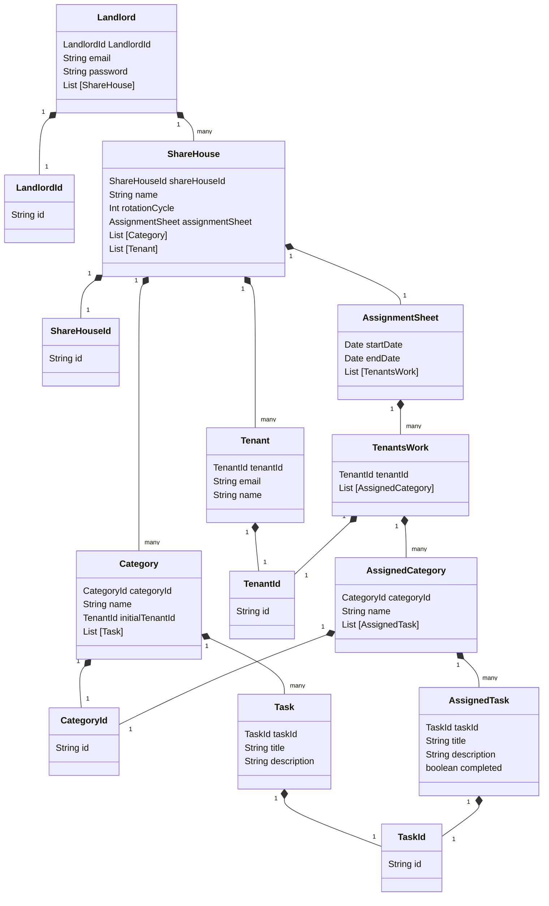

# Domain model

# Terms and Constraints

## Landlord - 大家

### Landlord

The Landlord is the user of Tascurator.
The Landlord contains ShareHouse.

### Landlord ID (Identifier)

The Landlord ID is a UUID.

### Email Address (Value Object)

The Landlord has an email address.

Constraints:

- Uniqueness
- In a valid format

### Password

The Landlord has a password.

Constraints:

- Less than or equal to 8 characters long
- Greater than or equal to characters long
- At least 1 capital letter
- At least 1 lowercase letter
- At least 1 special character
- At least 1 number
- Can be modified by the Landlord at any time

## ShareHouse - シェアハウス

## Category - カテゴリー

## Task - タスク

## Tenant - テナント

## AssignmentSheet - 分担票

## TenantsWork - 割当

## TenantsWork(Entity)

TenantsWork refers to the set of tasks assigned(AssignedCategory) to each tenant.

Constraints:

- Cannot exist without any AssignedCategory.
- Have only 1 TenantId.
- Can have greater than or equal to 1 AssignedCategory.

### Tenant ID

The TenantsWork class has Tenant ID. TenantsWork will be created per Tenant.

### AssignedCategory

The TenantsWork contains AssignedCategory. The TenantsWork class has AssignedCategory list.

## AssignedCategory -　

## AssignedTask - 割当タスク

### taskId

A UUID set for `Task` assigned to a `Tenant`.

### title

A task which is assigned to each `Tenant`
AssignedTask, which refers to a `Task`, cannot exist without `Task`.

### description

A description of each AssignedTask

### completed

A boolean value of a task status.
