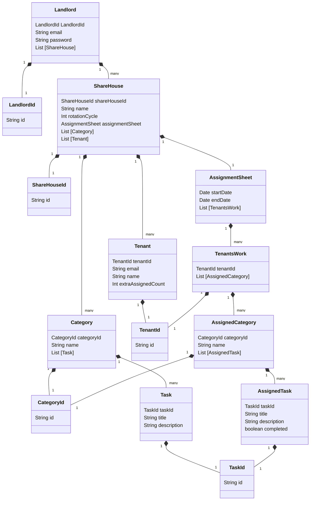

# Domain model

# Terms and Constraints

## Landlord - 大家

### Landlord

The Landlord is the user of Tascurator.
The Landlord contains ShareHouse.

### Landlord ID (Identifier)

The Landlord ID is a UUID.

### Email Address (Value Object)

The Landlord has an email address.

Constraints:

- Uniqueness
- In a valid format

### Password

The Landlord has a password.

Constraints:

- Less than or equal to 8 characters long
- Greater than or equal to characters long
- At least 1 capital letter
- At least 1 lowercase letter
- At least 1 special character
- At least 1 number
- Can be modified by the Landlord at any time

## ShareHouse - シェアハウス

## Category - カテゴリー

The Category is a group to which Task belongs. The landlord can add a Task to the Category after creating Category.  
Display a warning dialog when deleting Category that owns Tasks.

#### Constraints

- The maximum number of Categories is 15
- At least one Category per ShareHouse
- Category doesn't exist unless there is at least one task associated with it

### Category ID

Category ID is the UUID.

### Name

The name of Category to which Task belongs.  
Kitchen, Bathroom, Entrance and Living room are set by default. The landlord can create additional categories as they like apart from those listed.

#### Constraints

- Uniqueness
- Less than or equal to 15 letters
- Greater than or equal to 1 letter
- Can be modified by Landlord as they like
- Uppercase and lowercase letters are recognized as the same characters

### List [Task]

Category contains a list of tasks.  
Display a waring dialog when relocating a Task, which is the only one in the Category, to another Category.

#### Constraints

- Must contain at least one Task
- Can relocate to only existing Category

## Task - タスク

### Task

A specific work or activity that tenants are responsible for performing.

### taskId (Identifier)

The TaskId is a UUID

### title

The title is a name of the task

Constraints:

- at least 1 character
- less than 20 characters
- can be modified at any time
- must be contained in a `Category`

### description

The `Landlord` can provide details for a task.

Constraints:

- at least 10 characters
- less than 1000 characters
- can be modified at any time
- can use bold, italic, and a bulleted or numbered list

## Tenant - テナント

### Tenant ID (Identifier)

The Tenant ID is the UUID.

### Name

The Tenant has a name.

Constraints:

- Greater than or equal to 1 character and less than or equal to 15 characters
- Uniqueness
- Does not have to be the legal name; an arbitrary name can be used instead
- Can be changed anytime

### Email Address (Value Object)

The Tenant has an email address.

Constraints:

- Uniqueness
- Should be recognized consistently, irrespective of capitalization
- Cannot be changed after sending invitation mail

### extraAssignedCount

The default number of The extraAssignedCount is 0. If the number of Categories is larger than the number of Tenants, extraAssignedCount is used to ensure that an equal number of tasks(Category) is assigned to each Tenant.

Constraints:

- Greater than 0
- Integer

## AssignmentSheet - 分担票

Tenant's task assignment table.  
The AssignmentSheet is including startDate, endDate and TenantsWork.

Constraints：

- Cannot exist without startDate, endDate and TenantsWork

### startDate

The startDate of the task to be performed by the Tenant.

Constraints：

- Must contain the startDate
- The time zone is PST (Pacific Standard Time)

### endDate:

The deadline for completing the task.

Constraints：

- The time zone is PST (Pacific Standard Time)

### List [TenantsWork]

The TenantsWork has tasks assigned to each tenant AssignedCategory.

## TenantsWork - 割当

## TenantsWork(Entity)

TenantsWork refers to the set of tasks assigned(AssignedCategory) to each tenant.

Constraints:

- Cannot exist without any AssignedCategory.
- Have only 1 TenantId.
- Can have greater than or equal to 1 AssignedCategory.

### Tenant ID

The TenantsWork class has Tenant ID. TenantsWork will be created per Tenant.

### AssignedCategory

The TenantsWork contains AssignedCategory. The TenantsWork class has AssignedCategory list.

## AssignedCategory -　割当カテゴリー

Category assigned to each tenant.  
AssignedCategory, which refers to the Category, cannot exist without Category.

### Category ID

Category ID is the UUID set for Category assigned to a tenant.

### Name

Name is set for Category assigned to a tenant.

### List [AssignedTask]

AssignedCategory contains a list of AssignedTasks.

## AssignedTask - 割当タスク

### taskId

A UUID set for `Task` assigned to a `Tenant`.

### title

A task which is assigned to each `Tenant`
AssignedTask, which refers to a `Task`, cannot exist without `Task`.

### description

A description of each AssignedTask

### completed

A boolean value of a task status.
