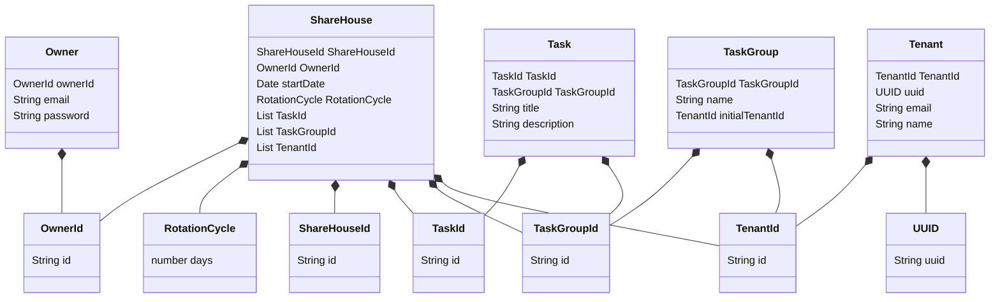

```mermaid
classDiagram
    class Owner {
        OwnerId ownerId
        String email
        String password
    }

    class OwnerId {
        String id
    }

    class ShareHouse {
        ShareHouseId ShareHouseId
        OwnerId OwnerId
        Date startDate
        RotationCycle RotationCycle
        List TaskId
        List TaskGroupId
        List TenantId
    }

    class RotationCycle {
        number days
    }

    class ShareHouseId {
        String id
    }

    class Task {
        TaskId TaskId
        TaskGroupId TaskGroupId
        String title
        String description
    }
    
    class TaskId {
        String id
    }

    class TaskGroup {
        TaskGroupId TaskGroupId
        String name
        TenantId initialTenantId
    }
    
    class TaskGroupId {
        String id
    }

    class Tenant {
        TenantId TenantId
        UUID uuid
        String email
        String name
    }
    
    class TenantId {
        String id
    }
    
    class UUID {
        String uuid
    }

    Owner *-- OwnerId
    ShareHouse *-- OwnerId
    ShareHouse *-- RotationCycle
    ShareHouse *-- ShareHouseId
    ShareHouse *-- TaskId
    Task *-- TaskId
    TaskGroup *-- TaskGroupId
    Task *-- TaskGroupId
    ShareHouse *-- TaskGroupId
    Tenant *-- TenantId
    TaskGroup *-- TenantId
    ShareHouse *-- TenantId
    Tenant *-- UUID
```