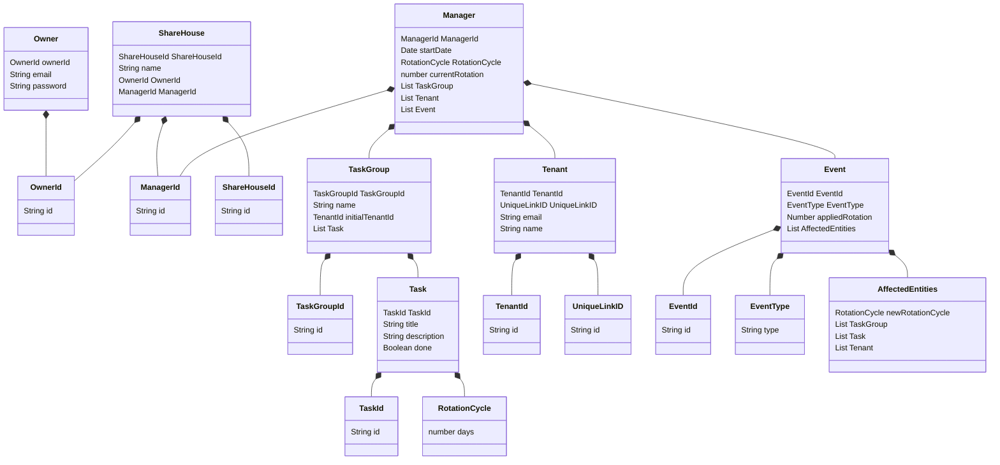

```mermaid
classDiagram
    class Owner {
        OwnerId ownerId
        String email
        String password
    }

    class OwnerId {
        String id
    }

    class ShareHouse {
        ShareHouseId ShareHouseId
        String name
        OwnerId OwnerId
        ManagerId ManagerId
    }
    
    class Manager {
        ManagerId ManagerId
        Date startDate
        RotationCycle RotationCycle
        number currentRotation
        List TaskGroup
        List Tenant
        List Event
    }
    
    class ManagerId {
        String id
    }

    class RotationCycle {
        number days
    }

    class ShareHouseId {
        String id
    }

    class TaskGroup {
        TaskGroupId TaskGroupId
        String name
        TenantId initialTenantId
        List Task
    }

    class TaskGroupId {
        String id
    }

    class Task {
        TaskId TaskId
        String title
        String description
        Boolean done
    }
    
    class TaskId {
        String id
    }

    class Tenant {
        TenantId TenantId
        UniqueLinkID UniqueLinkID
        String email
        String name
    }
    
    class TenantId {
        String id
    }
    
    class UniqueLinkID {
        String id
    }

    class Event {
        EventId EventId
        EventType EventType
        Number appliedRotation
        List AffectedEntities
    }

    class EventId {
        String id
    }

    class EventType {
        String type
    }

    class AffectedEntities {
        RotationCycle newRotationCycle
        List TaskGroup
        List Task
        List Tenant
    }

    Owner *-- OwnerId
    ShareHouse *-- OwnerId
    ShareHouse *-- ShareHouseId
    ShareHouse *-- ManagerId
    Manager *-- Event
    Manager *-- ManagerId
    Manager *-- TaskGroup
    Manager *-- Tenant
    TaskGroup *-- TaskGroupId
    TaskGroup *-- Task
    Event *-- EventId
    Event *-- EventType
    Event *-- AffectedEntities
    Task *-- TaskId
    Task *-- RotationCycle
    Tenant *-- TenantId
    Tenant *-- UniqueLinkID
```