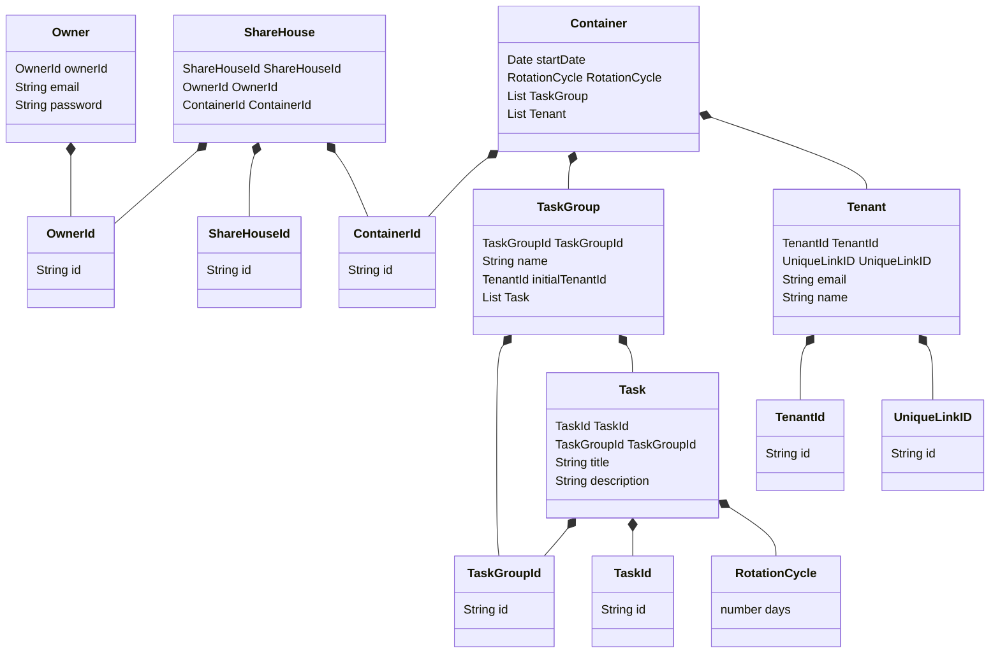

```mermaid
classDiagram
    class Owner {
        OwnerId ownerId
        String email
        String password
    }

    class OwnerId {
        String id
    }

    class ShareHouse {
        ShareHouseId ShareHouseId
        OwnerId OwnerId
        ContainerId ContainerId
    }
    
    class Container {
        Date startDate
        RotationCycle RotationCycle
        List TaskGroup
        List Tenant
    }
    
    class ContainerId {
        String id
    }

    class RotationCycle {
        number days
    }

    class ShareHouseId {
        String id
    }

    class TaskGroup {
        TaskGroupId TaskGroupId
        String name
        TenantId initialTenantId
        List Task
    }

    class TaskGroupId {
        String id
    }

    class Task {
        TaskId TaskId
        TaskGroupId TaskGroupId
        String title
        String description
    }
    
    class TaskId {
        String id
    }

    class Tenant {
        TenantId TenantId
        UniqueLinkID UniqueLinkID
        String email
        String name
    }
    
    class TenantId {
        String id
    }
    
    class UniqueLinkID {
        String id
    }

    Owner *-- OwnerId
    ShareHouse *-- OwnerId
    ShareHouse *-- ShareHouseId
    ShareHouse *-- ContainerId
    Container *-- ContainerId
    Container *-- TaskGroup
    TaskGroup *-- TaskGroupId
    Container *-- Tenant
    TaskGroup *-- Task
    Task *-- TaskGroupId
    Task *-- TaskId
    Task *-- RotationCycle
    Tenant *-- TenantId
    Tenant *-- UniqueLinkID
```