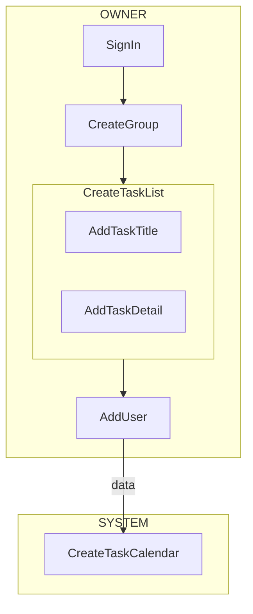
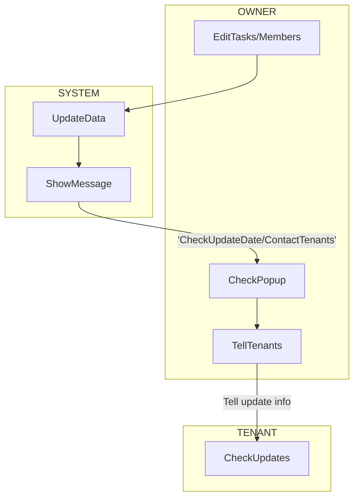

# NEW TASK FLOWCHART

## Flowchart1 : Owner sign up

```mermaid
flowchart TB
  %% Owner graph
  subgraph OWNER
    direction TB
    SignIn --> CreateGroup
    CreateGroup --> CreateTaskList
    subgraph CreateTaskList
      AddTaskTitle
      AddTaskDetail
    end
    CreateTaskList --> AddUser
  end

  %% System graph
  subgraph SYSTEM
    direction TB
    CreateTaskCalendar
  end

  %% Connect tasks
    AddUser -- data --> CreateTaskCalendar
```

## Flowchart2 : Routine tasks

```mermaid
flowchart LR
  %% Kai-san create
```

## Flowchart3 : Edit tasks and members

```mermaid
flowchart TB
  %% Owner graph
  subgraph OWNER
    direction TB
    EditTasks/Members
    CheckPopup
    CheckPopup --> TellTenants

  end

  %% System graph
  subgraph SYSTEM
    direction TB
    UpdateData
    UpdateData --> ShowMessage
    ShowMessage -- 'CheckUpdateDate/ContactTenants' --> CheckPopup
  end

  %% Tenant graph
  subgraph TENANT
    direction TB
    CheckUpdates
  end

  %% Connect tasks
  EditTasks/Members --> UpdateData
  TellTenants -- Tell update info --> CheckUpdates
```
